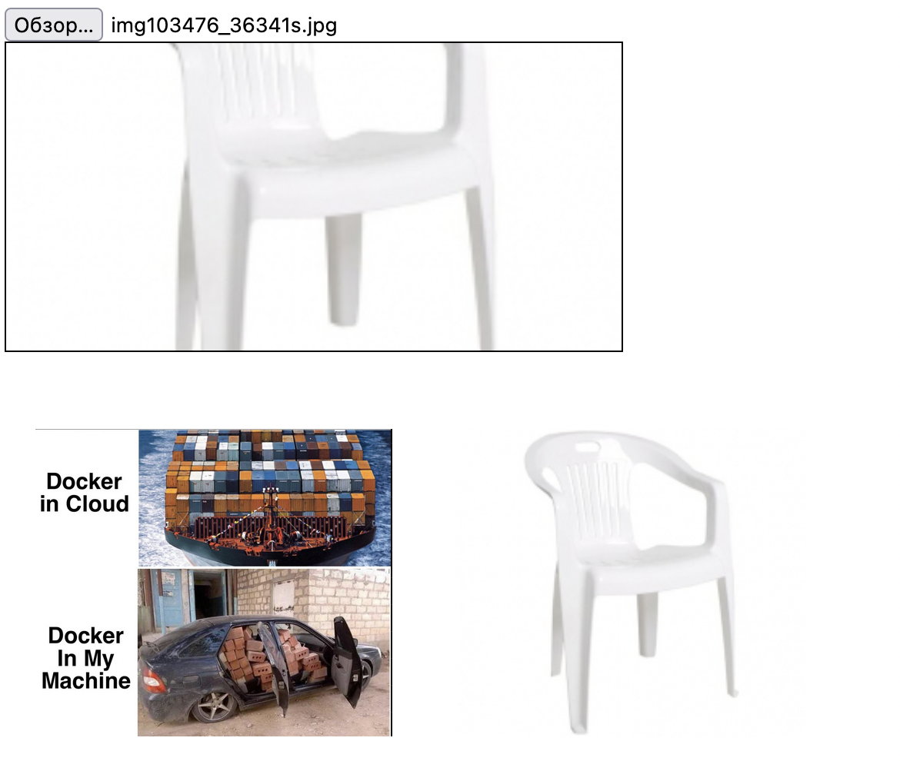

<h1 align="center">
    
</h1>

#  test-server-client-app

## Описание:

  <br>Проект по изучению Docker
  <br>[Ссылка](https://habr.com/ru/company/ruvds/blog/450312/) на руководство по Docker Compose для начинающих и кода серверной части
  
  ```
  ├── client/
  |   ├── client.py
  |   └── Dockerfile
  ├── doc
  |   └── Screenshot.png
  |
  ├── server/
  |   ├── index.html
  |   ├── server.py 
  |   └── Dockerfile
  |
  └── docker-compose.yml
  ```

## Стэк:
<p>
  &nbsp;
  &nbsp;
  &nbsp;
  &nbsp;
  &nbsp;

</p>

## Задачи:
  <br>Изучить и создать docker контейнеры для сервера и клиента
  <br>Изучить и создать Docker-compose файл для запуска контейнеров

## Установка и запуск

##### `docker-compose build` – собрать проект

##### `docker-compose up` – запуск проекта ( http://localhost:1234/ )
